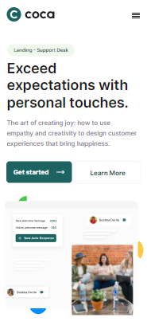
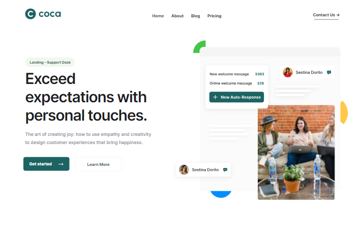

# Projeto Réplica de Site
 
Atividade Avaliativa: Criar um site usando um layout fornecido no Figma

## Índice
- <a href="#autor-do-projeto">Autor do Projeto</a>
- <a href="#layout">Layout</a>
- <a href="#demonstração">Demonstração</a>
- <a href="#tecnologias-utilizadas">Tecnologias Utilizadas</a>

## Autor do Projeto
Autor: Vinicius Vieira Murara 
Turma: MI-75

## Layout

 

## Demonstração
- [Link de acesso](https://site-coca.vercel.app/)

## Tecnologias Utilizadas
1. [Visual Studio Code](https://code.visualstudio.com/)
2. [Figma](https://www.figma.com/pt-br/)
3. [Github](https://github.com/)
4. [Github Desktop](https://github.com/apps/desktop)
5. [Vercel](https://vercel.com/)